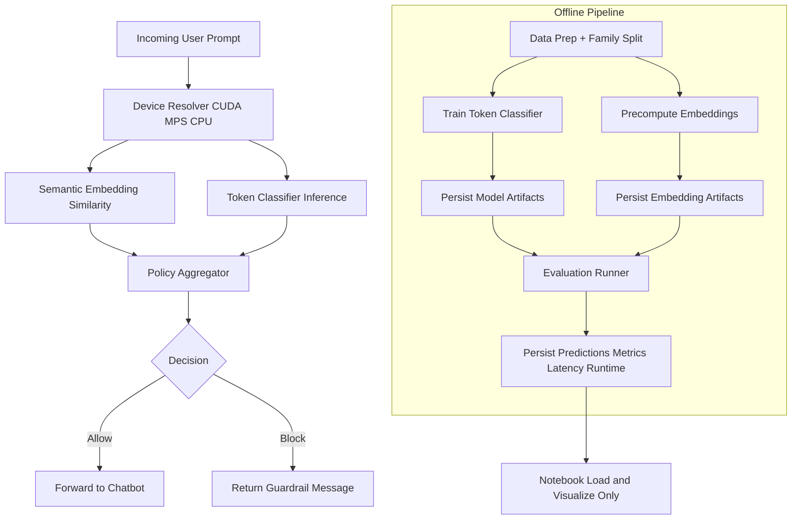

# Adversarial Prompt Injection Guardrail Evaluation Suite

## Project Summary
This repository implements a defense-in-depth guardrail middleware for customer-facing chatbots. The guardrail executes before chatbot inference and combines semantic similarity, lightweight token-level classification, and policy fusion to decide whether to allow or block a prompt.

Primary goals:
- High adversarial prompt blocking performance.
- Low added latency.
- Reproducible, artifact-driven evaluation.
- Notebook reporting that only loads precomputed outputs.

## Theory (Extensive)
### Prompt Injection Threat Model and Attack Surface
Prompt injection occurs when untrusted user content causes a model to prioritize malicious instructions over system policy or application constraints. The threat surface includes direct user prompts, retrieved context, tool outputs, and multi-turn conversation state. A practical guardrail must therefore inspect both lexical patterns and semantics across turns, not only isolated prompt text.

### Defense-in-Depth for Hybrid Detectors
No single detector consistently captures all attack forms:
- Similarity lookup can catch paraphrases and known attack families but may miss novel lexical tricks.
- Token-level classifiers capture suspicious language patterns but can overfit style.
- Policy fusion allows calibrated tradeoffs and interpretable block reasons.

Layering these components reduces single-point failure and provides more robust behavior under adaptive adversaries.

### Semantic Similarity and Neighborhood Detection
Embedding models map text to vector space where semantic neighbors cluster. Prompt-injection detection can be cast as nearest-neighbor retrieval against known adversarial references. If a query lies near adversarial centroids and far from benign clusters, the posterior risk increases. This approach supports paraphrase robustness and obfuscation tolerance relative to exact string matching.

### Lightweight Classifier Decision Boundaries and Calibration
A lightweight text classifier (TF-IDF + logistic regression in this implementation) estimates adversarial likelihood from token patterns and n-grams. Calibration of thresholds determines user-friction versus recall. In safety-critical front-door filtering, high recall on adversarial prompts is often prioritized, while false positives are bounded with explicit targets.

### Multi-Turn Context Poisoning Dynamics
Attacks can be staged:
1. Early benign turn establishes trust.
2. Mid-turn poisoning injects hidden authority framing.
3. Later exploit references prior poisoned context indirectly.

Turn-level detection alone can miss session-level exploitation. Evaluation therefore reports both turn-level and session-level block outcomes.

### Security Recall vs User Friction
Increasing aggressiveness improves block rate but can raise false positives on legitimate users. This is an ROC-style operating-point decision and should be tuned against product risk appetite. The suite tracks adversarial block rate, benign false positive rate, and threshold-linked policy behavior.

### Latency-Accuracy Optimization Under Real-Time Constraints
Guardrails on live chat paths require strict latency budgets. Retrieval and linear models are computationally efficient; high-capacity generative moderation models are often too slow or costly for always-on front-door gating. This design intentionally favors low-latency primitives while retaining semantic robustness.

### Evaluation Rigor and Leakage Resistance
Random sample splitting can leak paraphrase families across train/test and inflate apparent performance. This implementation splits by family ID to isolate variant clusters, preserving realistic generalization tests. Runtime summaries and lineage manifests provide reproducibility and auditability.

### Why Weak-Model-Derived Attacks Still Matter
Even if generated by smaller local models, attacks can represent realistic prompt structures (override phrasing, role-play jailbreaks, encoded directives). They are useful stress tests for decision boundaries and robustness trends, while not claiming coverage of the full adaptive attacker space.

### Static Benchmark Limitations
Offline benchmarks cannot model live adversarial adaptation, policy drift, or retrieval/toolchain side channels. Reported metrics should be interpreted as baseline robustness indicators rather than formal guarantees.

## Theory Applied to This Implementation
| Theory Concept | Implementation Modules | Metrics | Artifacts |
|---|---|---|---|
| Semantic neighborhood risk | src/guardrail/embedding_layer.py, src/guardrail/pipeline.py | adversarial block rate, AUROC | artifacts/embeddings/*.npz, artifacts/embeddings/index_metadata.json |
| Token-level suspicious patterns | src/guardrail/token_classifier_layer.py, scripts/train_token_classifier.py | precision, recall, F1, AUPRC | artifacts/models/token_classifier.joblib, artifacts/models/model_metadata.json |
| Calibrated policy fusion | src/guardrail/policy_aggregator.py | false positive rate, decision reason distribution | artifacts/predictions/test_predictions.jsonl |
| Multi-turn poisoning | src/evaluation/multi_turn_evaluator.py | session block rate | artifacts/metrics/summary.json |
| Real-time feasibility | src/evaluation/latency_profiler.py | p50/p95/p99, throughput | artifacts/metrics/latency_profile.json |
| Leakage resistance | scripts/prepare_data.py | split integrity checks | artifacts/datasets/splits_manifest.json, artifacts/datasets/family_map.json |

## Codebase Flow Diagram


## Experimental Setup and Reproducibility
- Python package management: uv
- Local-only inference and training primitives (no external inference API)
- Device resolution order: CLI flag, environment override, auto-detect CUDA/MPS/CPU
- Every script prints and logs selected device, fallback reason, and runtime duration

### End-to-End Commands
1. Install dependencies:
```bash
uv sync
```
2. Data preparation:
```bash
PYTHONPATH=src uv run python scripts/prepare_data.py
```
3. Train classifier:
```bash
PYTHONPATH=src uv run python scripts/train_token_classifier.py
```
4. Precompute embeddings:
```bash
PYTHONPATH=src uv run python scripts/precompute_embeddings.py
```
5. Run evaluation:
```bash
PYTHONPATH=src uv run python scripts/run_evaluation.py
```
6. Run real LLM before/after evaluation:
```bash
PYTHONPATH=src uv run python scripts/run_llm_before_after_eval.py --model-id TinyLlama/TinyLlama-1.1B-Chat-v1.0
```
7. Validate notebook preconditions:
```bash
PYTHONPATH=src uv run python scripts/validate_notebook.py
```
8. Execute notebook rendering:
```bash
uv run jupyter nbconvert --to notebook --execute notebooks/evaluation_report.ipynb --output evaluation_report.executed.ipynb
```

## Artifact Inventory and Schema
- Models:
	- artifacts/models/token_classifier.joblib
	- artifacts/models/model_metadata.json
- Embeddings:
	- artifacts/embeddings/benign_embeddings.npz
	- artifacts/embeddings/adversarial_embeddings.npz
	- artifacts/embeddings/index_metadata.json
- Predictions and metrics:
	- artifacts/predictions/test_predictions.jsonl
	- artifacts/metrics/summary.json
	- artifacts/metrics/confusion_matrix.json
	- artifacts/metrics/confusion_matrix.png
	- artifacts/metrics/per_category_metrics.json
	- artifacts/metrics/latency_profile.json
	- artifacts/metrics/runtime_summary.json
	- artifacts/predictions/llm_before_after.jsonl
	- artifacts/metrics/llm_before_after_summary.json
	- artifacts/metrics/llm_before_after_runtime.json
- Dataset lineage:
	- artifacts/datasets/splits_manifest.json
	- artifacts/datasets/family_map.json

## Performance and Latency Interpretation
- Adversarial block rate indicates attack interception effectiveness.
- Benign false positive rate quantifies user-friction risk.
- p95 latency captures tail behavior relevant to production SLOs.

Compare summary metrics against configured targets:
- Block rate target: >= 95%
- Benign false positive target: <= 2%
- Latency target: p95 < 50 ms

## Notebook Visualization Example
Generated confusion matrix image from notebook execution:


## Limitations, Threats to Validity, and Future Work
Limitations:
- Fallback synthetic data may be used when dataset download fails.
- Static benchmark attacks do not represent full adaptive attacker behavior.
- Embedding backend may fall back to deterministic hashing if transformer weights are unavailable locally.

Threats to validity:
- Class imbalance and synthetic variant distributions can bias measured rates.
- Dataset schema drift in external sources can change ingestion behavior.

Future work:
- Add calibrated confidence intervals via bootstrap.
- Extend to retrieval-augmented and tool-calling attack surfaces.
- Add adversarial training loops for hard-negative mining.

## Responsible Use and Disclosure
This repository contains adversarial prompt examples for defensive research and guardrail benchmarking only. Do not deploy attack content for abuse. Validate safety controls and legal requirements before production deployment.
